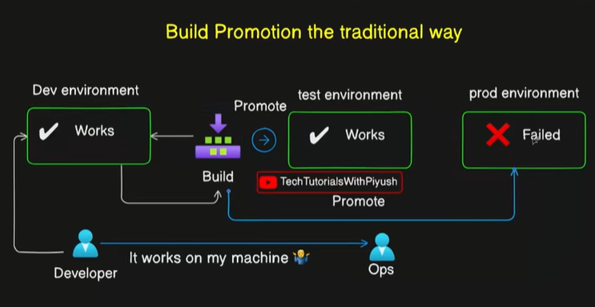
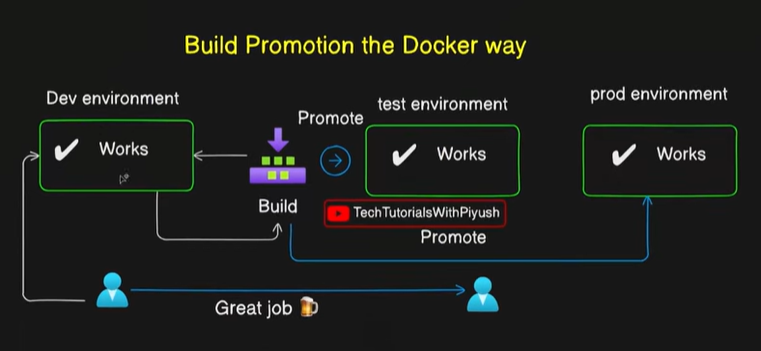
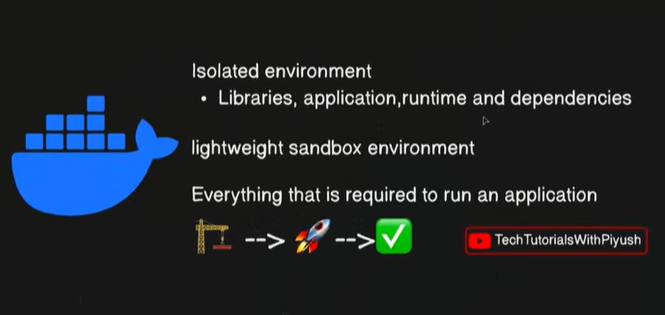
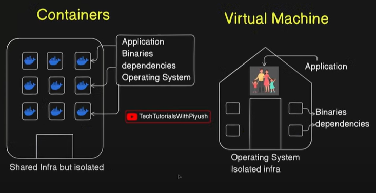
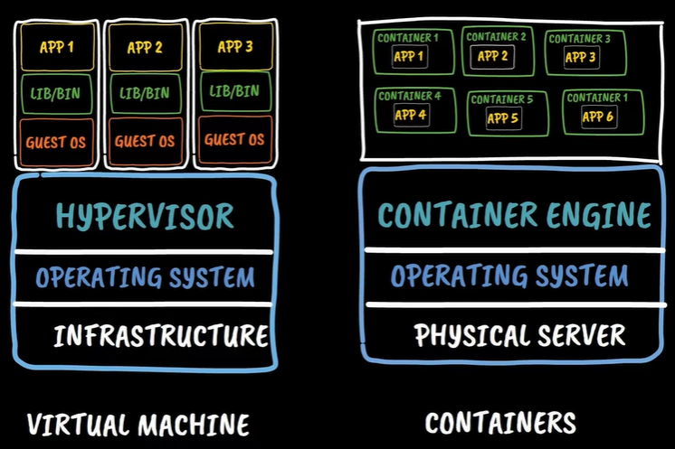
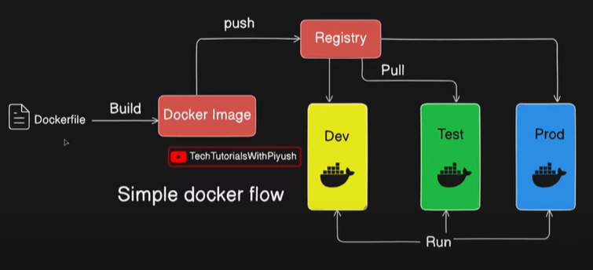
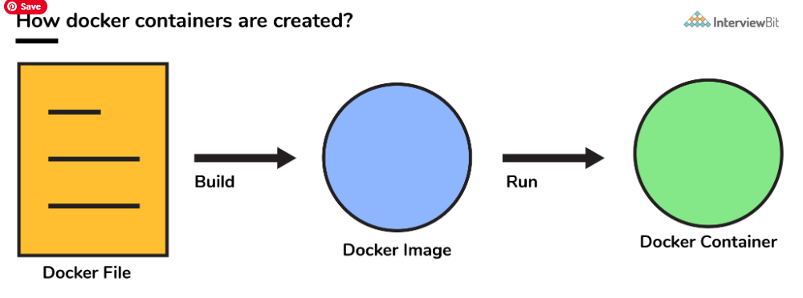
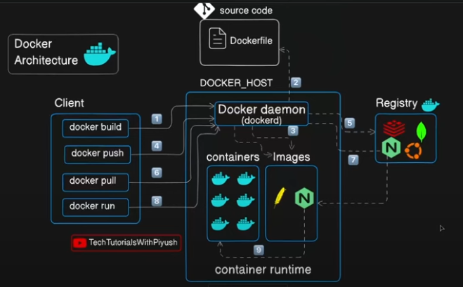

# Docker Fundamentals

## Traditional Build Promotion Problems



In conventional software development workflows, organizations typically maintain three distinct environments:

* **Development Environment** - Where developers write and initially test code
* **Test Environment** - Where comprehensive testing occurs before production
* **Production Environment** - The live environment serving end users

To the Development-to-Production Journey the standard process follows below steps:

1. Developers work on features and merge code into the Version Control System
2. Builds are created and deployed to the development environment
3. After successful dev testing, builds are promoted to the test environment
4. Finally, builds are promoted from the build repository to production

Even builds working perfectly in both development and test environments (which typically have identical configurations and infrastructure), production deployments frequently fail. This failure occurs even when promoting the exact same build that succeeded in lower environments. The most common reasons for production deployment failures are:

* Environment Misconfiguration 
* Missing Dependencies
* Change Management Constraints
    * Production environments require formal change request processes
    * All modifications need multiple approvals before implementation
    * Random changes to production are prohibited for security and stability

This situation creates the infamous "it works on my machine" syndrome, 
* Developers insist the code is correct since it works in lower environments
* Operations teams point to infrastructure or environment issues
* Blame shifts between development, operations, and other teams
* Productivity suffers due to finger-pointing and troubleshooting delay

The fundamental problem was the inability to package all necessary components together: (Application code, Dependencies and libraries, Configuration settings and Runtime environment specifications). 

Without a way to bundle these elements into a single, portable unit that could be consistently deployed across all environments, organizations faced continuous deployment challenges and environment inconsistencies. This is where containers came into the picture.

## How Docker Transforms the Deployment Process



With containerization, the same build promotion workflow becomes dramatically more reliable:

* **Development Environment** - Application works fine, packaged in a container
* **Test Environment** - Same container works fine with identical behavior
* **Production Environment** - Container deployment succeeds consistently

When using containers, you're not just shipping application code. Instead, you're packaging and deploying:

* Application code and logic
* All required dependencies and libraries
* Runtime environment specifications
* Complete operating system image
* Configuration settings

This comprehensive packaging approach eliminates the primary causes of production deployment failures.

Container deployments are significantly more reliable because they eliminate environment-related failure points:
### Eliminated Failure Causes:

* Environment misconfiguration issues
* Infrastructure alignment problems
* Missing dependencies
* Library version conflicts

### Remaining Potential Issues:
While containers solve configuration problems, some issues may still occur:

* Network connectivity problems
* Infrastructure health issues
* Hardware-related failures
* Resource availability constraints

However, these remaining issues are infrastructure-related rather than application packaging problems. But the Result: Universal Team Satisfaction

* Developers are happy - Their code works consistently across environments
* Operations teams are happy - Fewer deployment failures and troubleshooting sessions
* Everyone benefits - Reduced finger-pointing and faster deployment cycles

## What Exactly Are Containers?



Containers provide an isolated environment that includes everything an application needs to run:

* Application code and runtime
* Required libraries and dependencies
* Operating system components
* Configuration files and settings

Containers ensure consistent behavior regardless of the host operating system. Your application might be built for Ubuntu, CentOS, or Red Hat Linux but the container will run identically on any host system. The guest operating system is packaged within the container itself and Host OS differences will become irrelevant.

Containers are often called "lightweight sandbox environments" because:

* Contains use only the bare minimum operating system components
* Includes only libraries and packages required for the application
* Excludes unnecessary binaries from vanilla OS installations
* Results in significantly smaller image sizes compared to full operating systems
* Provides complete isolation from the host system
* Creates a controlled, predictable runtime environment

## The Three-Step Process
Container management follows a simple, systematic approach:

* **BUILD** - Create the container image with application and dependencies
* **SHIP** - Distribute the container image across environments
* **RUN** - Execute the container in any target environment

This process ensures consistency and repeatability across all deployment stages.

## Docker vs. Containers: Clearing the Confusion

Many people confuse containers with Docker, but they serve different roles:
    * **Containers** - The concept and technology for isolated, portable application packaging
    * **Docker** - A platform that helps you execute container operations

Docker provides the tools and infrastructure to:

* Build container images
* Ship images to different environments
* Run containers consistently
* Manage container lifecycle

## Containers vs Virtual Machines



To better understand the fundamental differences between containers and virtual machines, consider this real-world analogy.

| Concept           | Analogy                     | Description                                                                 |
|-------------------|-----------------------------|-----------------------------------------------------------------------------|
| Virtual Machine   | Independent House           | - A virtual machine is like owning an entire house <br> - Complete with all utilities, rooms, and infrastructure <br> - Designed for one family (one primary application) <br> - Full control but higher resource consumption |
| Container         | Apartment in a Building     | - A container is like living in an apartment building <br> - Shared infrastructure (building, land, utilities) <br> - Multiple tenants (applications) in the same building <br> - Isolated units with controlled access between apartments |

### Resource Utilization: 

| Concept           | Analogy & Efficiency        | Description                                                                 |
|-------------------|-----------------------------|-----------------------------------------------------------------------------|
| Virtual Machines (Resource Intensive) | Separate House on Individual Land | - Each VM operates like a separate house on individual land <br> - One application per virtual machine (one family per house) <br> - Significant resource wastage due to underutilization <br> - Example: A house with 6 rooms for a 3-member family leaves 3 rooms unused |
| Containers (Resource Efficient) | Apartments in a Shared Building   | - Multiple containers share the same infrastructure <br> - Like multiple families sharing one building on shared land <br> - Optimal resource utilization across all applications <br> - Containers scale up and down based on actual requirements |

### Key Architectural Differences

| Aspect            | Virtual Machines                        | Containers                          |
|-------------------|-----------------------------------------|-------------------------------------|
| Operating System  | Each VM has its own complete OS          | Share the host OS kernel            |
| Resource Sharing  | Dedicated resources per VM               | Shared infrastructure               |
| Isolation         | Complete isolation with separate OS      | Process-level isolation             |
| Resource Usage    | Higher overhead, potential waste         | Minimal overhead, efficient usage   |


| Virtual Machine Architecture | Container Architecture |
|------------------------------|-------------------------|
| **Components of VM Infrastructure** | **Components of Container Infrastructure** |
| **Physical Layer:** <br> - Physical server in data center (public cloud) or personal desktop <br> - Shared hardware used by multiple organizations and users | **Physical Server and Host OS:** <br> - Same foundation as virtual machines <br> - Single operating system kernel shared across containers |
| **Host Operating System:** <br> - Windows or Linux running on physical hardware <br> - Provides interface between hardware and virtualization layer | **Container Engine (Instead of Hypervisor):** <br> - Replaces hypervisor functionality for container management <br> - Examples: Docker Engine, containerd, CRI-O <br> - Enables multiple container instances on single OS kernel |
| **Hypervisor:** <br> - Critical component enabling virtualization <br> - Allows multiple operating system instances to run concurrently <br> - Examples: VMware vSphere, Microsoft Hyper-V, KVM | **Container Instances:** <br> - Lightweight, isolated application environments <br> - Share host OS kernel but maintain process isolation <br> - Each container includes only necessary libraries and binaries |
| **Guest Virtual Machines:** <br> - Individual VM instances running on the hypervisor <br> - Each VM contains its own complete operating system <br> - Users install binaries, libraries, and applications independently | |


## Container vs Hypervisor Functionality



| Hypervisor Function | Container Engine Function |
|---------------------|---------------------------|
| - Runs multiple virtual machines on single operating system <br> - Provides hardware abstraction layer <br> - Manages resource allocation between VMs | - Runs multiple container instances on single OS kernel <br> - Provides process isolation and resource management <br> - Manages container lifecycle and networking |


### Container Advantages Over Virtual Machines

* **Lightweight Operation:**
    * No need for complete guest operating system
    * Significantly smaller resource footprint
    * Faster startup and shutdown times

* **Enhanced Efficiency:**
    * Shared OS kernel reduces resource duplication
    * Better resource utilization across applications
    * Lower infrastructure costs

* **Superior Portability:**
    * Consistent behavior across different host systems
    * Easier migration between environments
    * Simplified deployment processes

* **Optimized Resource Management:**
    * Dynamic scaling based on actual demand
    * Automatic resource allocation and deallocation
    * Minimal infrastructure waste


## The Complete Docker Workflow Step-by-Step Process 



How do we build our application, how do we ship it, how do we run our application with the help of a Docker container?

1. Build Phase

Docker file which is usually a set of instructions, has all commands which need to be run for building a given image. As we provide instructions to use this operating system as the base image (for example ubuntu), now install these dependencies on that and copy these files from my local system to that container and run this command to build the image and so on. Usually if you are working in an Enterprise usually your developers are responsible for creating the docker file along with the application code.

Now we have Docker file, and we build that Docker file to create a Docker image. Dependencies, libraries, application code, operating system...etc. everything will be packaged in a image. This image is the shipable image, and we can ship this image from one environment to another, we can ship from one environment to multiple environments. You cannot ship containers directly from one environment to another. The way you ship it is, with the help of an image. You run the ```docker build``` command and Docker build will create the docker image from the docker file. 

```
docker build -t myapp:v1.0 .
```

```docker build``` - This is the main command that tells Docker to build an image
```-t``` - The -t flag stands for "tag". It allows you to give your image a human-readable name.
```myapp:v1.0``` - The name and the version (v1.0) tag of the image.
```.``` - The dot (.) represents the current directory. This tells Docker where to find: The Dockerfile, Any files that need to be copied into the image, The "context" for building the image.

2. Ship Phase

Once you have the image ready, you cannot directly push the image to the dev environment or to the test environment or directly to the prod environment. You need an intermediate storage, you need a registry, to store those Docker images. 

### Why do we need a registry? 

It is for the same reason why you need a version control system, to store your source code. We use tools like GitHub, bit bucket, gitlab, a version control system to store our source code. We don't store our source code on on a Google drive or on a Dropbox, because that is not meant for this purpose. We want a repository, a storage, that will help us to track the changes that will help to make it easy for us to make the changes and easy to maintain. Same as the version control system for the source code, for storing the docker images we need to have a Docker registry and that will help us ship our images from one environment to another. Because these are the binaries these are not in the form of flat files. 

```
docker push myapp:v1.0
```

Docker image is uploaded to registry, Image becomes available for distribution and Multiple environments can access the same image.

3. Deploy Phase

With the help of ```docker pull``` command and the docker image can be pulled to different environments, (to Dev environment, to test environment, to prod environment). The binaries will then be pull to the desired environment and the ```docker run``` command will make sure that image (the package that we have which is called the docker image) will be converted into a running instance. Now our instance will be up and running our application will be running on the desired environment with the help of Docker image that we pulled. This is the basic workflow, how do you build an application how do you ship an application and how do you run your application when it comes to Containers.

```
docker pull myapp:v1.0
docker run myapp:v1.0
```

Image is downloaded to target environment, Running instance (container) is created from the image, Application becomes operational.



## Docker Architecture



Here we have our client machine with Docker installed, from which we’ll be running the docker commands. We usually store a ```Dockerfile``` in a Version Control System such as GitHub. A ```Dockerfile``` is simply a set of instructions. The default name of this file is ```Dockerfile``` (with an uppercase D). Although we can rename it if needed, following the default naming convention is considered best practice, and typically we keep it unchanged. Usually, we have one ```Dockerfile``` per application. When we run the ```docker build``` command, it is passed to the Docker daemon, which then builds the Docker image using the instructions in the Dockerfile. Once built, the image is stored locally.

Let’s assume we are building an NGINX container. The image is first stored in the local storage of the Docker host the virtual machine where Docker is running. The next step requires intermediate storage, an image hosting registry, where we can store the image so it can be shipped to other environments. To do this, we run the ```docker push``` command. This command interacts with the Docker daemon, which then pushes the image from the local registry to a remote image registry. The image registries could be Docker Hub, JFrog Artifactory, Nexus Registry, etc. Once pushed, the Docker image is available in the registry for use in other environments.

Now we want to deploy that image to an environment. For this, we run the ```docker pull``` command on the target environment. The pull command interacts with the Docker daemon, which then pulls the image from the registry to the environment. Once the image is pulled, we run the ```docker run``` command. This command is sent to the Docker daemon, which instructs the container runtime to spin up a container based on the image instructions. This is the entire architecture of a docker container. 